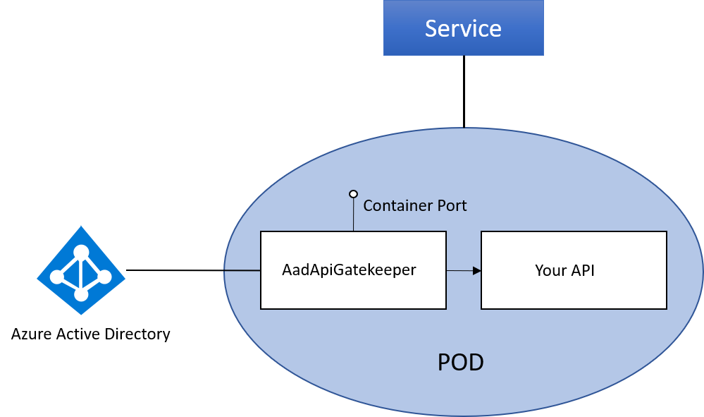

# AadApiGatekeeper

AadApiGatekeeper protects your API by enabling Azure Active Directory authentication.

## Description

The here implemented Gatekeeper can be used as a Reverse Proxy in front of your API that is hosted in a Kubernetes Cluster. The [SideCar](https://docs.microsoft.com/en-us/azure/architecture/patterns/sidecar) pattern is used to put the gatekeeper in front of your API.
Protecting an API using Azure Active Directory can often be anoying, especially if you are using programming languages
where no Azure Active Directory integration libraries are available or if you don't find any examples in the internet.
The AadApiGatekeeper is implemented in ASP.NET Core and can be used on every platfrom that supports the .NET Core runtime.



### Azure Active Directory Integration

The integration in Azure AD is very simple. You have to create an Azure AD application in your tenant and configure the Gatekeeper with the application's ClientId and ClientSecret.
Creating a new AAD application is shown [here](https://docs.microsoft.com/en-us/azure/active-directory/develop/quickstart-v1-integrate-apps-with-azure-ad).

### Features

- ReverseProxy to make sure there is a valid Azure AD token
- Get user's claims with a single call to ```http://localhost/me```
- Acquire tokens for other protected Azure AD resources using the *On-Behalf-Of* flow ```http://localhost/me/token/{resource}```
- Define public accessable routes in your API
- Simple Kubernetes integration ([SideCar example](doc/SideCarExample.md))
- Token caching
- Lightweight

### Configuration

Configuration is done using environment variables. There are two sections:

- Authentication
- Proxy

#### Authentication section

- ClientId -> the ClientId (or ApplicationId) of your registered Azure AD application
- ClientSecret -> the ClientSecret of your Azure AD application. This setting is needed for acquiring tokens to other protected Azure AD resources on behalf of the authenticated user
- Tenant -> Azure AD tenant id or directory name

#### Proxy section

- Port -> the port to use running the Gatekeeper
- ForwardPort -> the port to which requests are forwarded (port of your API)
- AnonymousPaths -> a comma separated list of public acessable routes in your API. E.g.: if you are using Swagger you have to specify ```/swagger``` or if you have additionally public routes ```/swagger,/public```